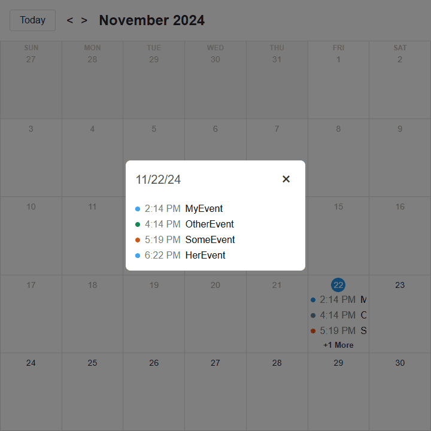

Practice code, tests, articles, tutorials and projects using TypeScript

# Pages
## [Calendar #1](https://github.com/levdoescode-practice/typescript/tree/path-001/11-calendar-project)
* Single page calendar using [TypeScript](https://www.typescriptlang.org/), [React](https://react.dev/) and [Vite](https://vite.dev/).
* Modal for adding and editing day events along with proper validations.
* Types for context, props and modals.
* Event data saved on local storage for persistance.

    

    
    
    

